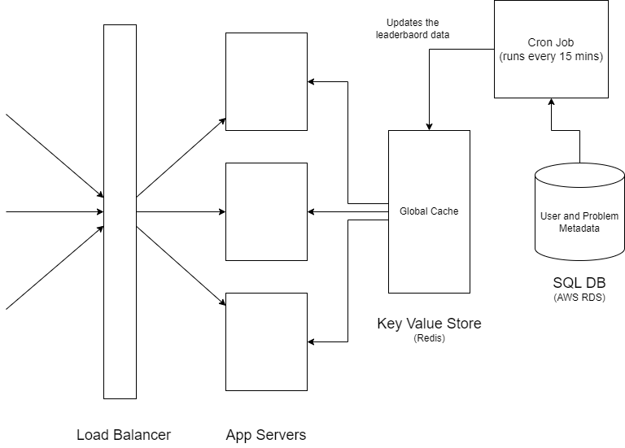

# Online Coding Platform

Design a system like HackerRank/CodeChef/LeetCode.

## Requirements

- User should be able to submit the solution of given problem.
- User can participate in any contest.
- Contest should start and end in given time frame.
- After end time, there will be no more submission.
- For each submission there will be a set of test cases that should execute in the backend.
- There should be language restriction for each given question.
- After contest, user can see the leaderboard.
- Evaluation of scores against each submission.
- Report generation, both real time and once contest is complete.

## Solution

There are typically 2 microservices required in this system -
1. To judge the submission of the user - code judge
2. To provide statistics of the contest and user - leaderboard

### Code Judge

**Q1. What is the data required by the microservices?**  

- User Data (user_id, user_name, password, score) 
- Problem Data (problem_id, problem_desc, allowedLang, points, difficulty, topics, testcase_version)
- Test Case Data (input.txt, expected_output.txt)

**Q2. What is the size of the Data?**  

- User Data + Problem Data - approx 1KB : should be stored in some SQL DB like AWS RDS
- TestCase Data - approx 1GB : should be stored in a DFS or a BLOB storage like AWS S3

Since testcase data is huge and loading such data from S3 for each request is
extremely expensive (cost and time) therefore we need **CACHING**!

If we use a **global cache** to store the test cases then for each request the app server will have to fetch
the data from the cache which will have a very high network overhead.  
Whereas keeping a local cache in the app server with the testcases will require only 1 network call
over to the DB and for each recurrent request the data can be fetched from the **local cache** (HDD
within the app server) (no network overhead).

**Q3. Can we cache all the testcases data?**  

Assuming there are approx 3000 problems with each problem having a testcases of approx 1GB size,
the total cache size required in each app server would be approx 3000 * 1GB = 3TB.
Since a typically a disk size cache is around 250GB, we cannot keep all the data in the cache.

**Q4. What eviction policy should be used?**  

LRU/LFU can be used as an eviction policy.  

**NOTE:** Eviction Policies are a lot dependent on the data.
AB Testing can be used to find the right eviction policy.

**Q5. How frequently do the testcases for a specific problem change?**  

Very rarely.  
But it might happen that during a contest it is found that the test cases are not strong enough
and needs to be changed, so the cached data would become stale and needs to be updated.

**Q6. What Invalidation policy should be used?**

**Requirement:** As soon as the new testcases are uploaded they should take effect.
Any new submissions should use the updated testcases - **Immediate Consistency**!

1. **Write Back** -> Potential data loss
2. **TTL** -> With small expiry time, like 1 min, the app server will have to fetch 1GB from S3
making the cache useless (too many cache misses) and with large expiry time, like 1 hour, 
very large staleness window, not good for contests.
3. **Write Around** -> How frequent the cron job should run?? Similar issue as TTL.
4. **Write Through** -> It gives IMMEDIATE CONSISTENCY! But assume there are 1000 app servers
then we'll have to update all 1000 servers and S3 DB atomically. And if even 1 of the servers is down
then the write will not succeed.

**Solution:** Write through cache with lazy cache update.  

Whenever the testcase needs to be updated, the new testcase is uploaded to the S3 DB directly
without deleting the old files (removes the requirement of 2PC). 
If S3 is successful, then modify the version no of the test case in the SQL DB.

If S3 succeeds but SQL fails, then just retry writing to SQL.

old test case -> prob1_input_v1.txt, prob1_expected_output_v1.txt  
new test case -> prob1_input_v2.txt, prob1_expected_output_v2.txt

| ProblemID | Problem_desc | Points | Difficulty | Topics | Testcase_version |
|-----------|--------------|--------|------------|--------|------------------|
|  Prob1    | Problem      | 100    | Easy       | Array  | ~~V1~~  V2       |

Both these testcase files are present in the S3 DB, but the version no of the test case files is updated
in the SQL DB.

**When submission comes for a Problem**

- App server will fetch user and problem metadata from SQL DB.
- It will check the local cache(HDD) for testcase files with the version no received from SQL.
- If files with the version no. is present, 
  - it will use them.
  - else it will fetch the testcase files from S3 DB and then use them.

**The invalidation can occur based on VersionNo OR ModifiedTime OR CheckSum.**

**Q7. What routing algorithm should be used?**  

Since we are using local cache, it makes the app servers stateful. As a result we should use consistent hashing.
However, in this case we continue to use **round-robin**, since defining a sharding key is not possible in this case.

**Q8. Can a single app server handle all the requests for a particular problem?**  

No. Evaluating a problem submission takes time. With all submissions of a particular problem
routed to the same server will increase the wait time.  
Also typically during a contest, almost all users would start by submitting to the first problem
leading to high load on the same server while other servers would remain idle.

**Q9. Can a single app server handle multiple requests simultaneously?**  

No. Evaluating a submission is a CPU bound task, so multithreading will only slow down the process.

**Q10. How many app servers would be required?**  

Assuming that typically it takes 10 secs to evaluate a submission and there are 100 requests per sec.
Then on receiving a request the app server would be busy for the next 10 seconds.
Therefore, to handle 100 * 10 = 1000 requests received every 10 secs, we would need 1000 servers.

- We can even keep a queue with the submission requests received in each app server and the server 
can pick up the next request from the queue each time it gets free. 
- We can even have multiple containers (Virtual Machines) in each of the server which can take up
a single request each and process them simultaneously.  
This way we can reduce the required servers but this will increase the latency as well.

### Leaderboard

**Q1. What are the typical requirements?**

1. View a Page of the Leaderboard - A page contains 15 ranks.
2. Show User's rank

**Q2. How many requests are received?**

Assumptions:
- 100,000 participants
- 5 problems
- 2 hours contest
- 5 submissions per participant (avg.)
- 5 submissions per problem (avg.)
- 10 leaderboard views per participant (avg.)

submissions/sec = (100,000 participants) * (5 submissions / participants) * (1 / 2 * 3600 secs)  
= 100 submissions / sec (approx.)

leaderboard views/sec = (10 views / participant) * (100,000 participants) * (1 / 2 * 3600 secs)
= 150 views / sec (approx.)

**Q3. What data is needed to calculate the leaderboard?**

- 10M Users
- 1K Contests
- 5K problems
- 500K testcases (100 testcases per problem)
- 100M contest participants (1% users participate in the contest * 1K contests)
- 5K contest problems (5 problems per contest * 1K contests)
- 2.5B user submissions (10% of users have solved 10% of the problems * 5 submissions per problem)
- 500M contest submissions (100M contest participants * 5 submissions per participant)

**Q4. How long does it take to calculate the leaderboard?**

1. Join 8 Tables
2. Fetch data of 500,000 submissions
3. Calculate total scores
4. Sort the scores

Assume, it would take around 30 secs to calculate the leaderboard.

**Q5. Should we calculate the leaderboard for each view request?**

No, it is not practical to run a 30 sec long job 150 times per sec.
We should cache the leaderboard data and update it every few minutes.

**Q6. What kind of cache should be used?**

To render a Leaderboard page we need, 15 items / page * 1KB / item = **15KB / page**, small data.  
Total data for a leaderboard of a running contest would be  
100,000 participants * 1KB / participant = 100MB data in cache.  
Assuming 10 contests are running simultaneously, we need 10 * 100MB = 1GB data.

Thus, we can use a single global cache.

**Q7. What Eviction Policy should be used?**

No eviction needed as only 1GB data is required to store in the cache.

**Q8. What Invalidation Policy should be used?**

Even though it is ok if there is a data loss as the data in the cache is being calculated and
not fetched directly from the DB, we prefer Write Back when the throughput is very high.  
Also since immediate consistency is not required or possible, we can go with eventual consistency.  

We will go with Write Around Policy and use a **Cron Job** that updates the cache every 15 mins!

## Complete Design

