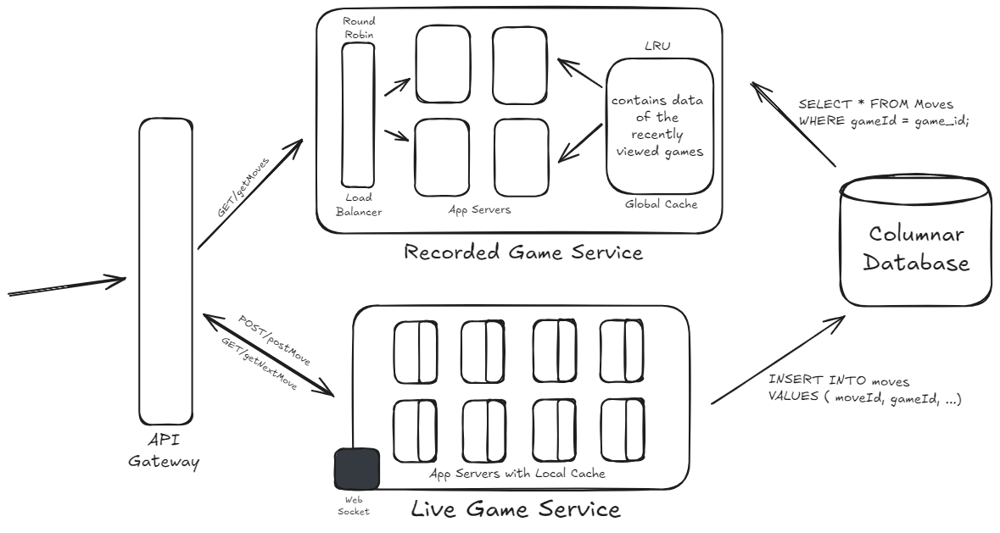

# Chess.com

Design a website like chess.com where users can play chess with each other.

## Functional Requirements

1. Users can play chess with each other.
2. Users can watch live games of other players.
3. Users can watch past games.

## APIs

1. To save moves made by the players: POST/postMove(gameId, piece, current_position, final_position, timestamp, prev_move) -> move
2. To get the next move of a live game: GET/getNextMove(gameId) -> move
3. To get all the moves of an old game: GET/getMoves(gameId) -> moves

## Non-Functional Requirements

1. Users playing the game should experience minimal latency.
2. The system should be consistent.
3. Ordering of moves should be maintained.

## Scale Estimation

Assuming,
1. Total users = 100M
2. Daily active users = 10% of Total Users = 10M users
3. Avg. no of games played by a player per day = 5 games
4. Daily active games = Daily Active Users * 5 games per player = 50M games
5. Daily active moves = 40 moves per game * 50M games = 2B moves

Therefore, Moves made per second = 2B / 24 hours / 3600 seconds = 23K moves per second  
**Write Requests (postMove) = 20,000 requests / sec (approx)**

Assuming all active users watch 5 recorded games per day,  
Therefore, total games watched per sec = 10M * 5 / 24 hours / 3600 seconds = 500 games per second  
**Read Requests (getMoves) = 500 requests / sec (approx)**

Assuming 10% of active users watch 5 live games per day,  
Therefore, moves watched per sec = 1M users * 20K moves per second = 20B moves per second  
**Read Requests (getNextMove) = 20B requests / sec (approx)**

Storing the data for past 10 years,  
Total games = 50M * 365 days * 10 years = 182.5B games 
Total moves = 2B * 365 days * 10 years = 7.3T moves  
**Total Data = (182B + 7.3T) * 50 bytes = 365 TB**

## Database Design

### Tables

1. **Users:** userId, name, email, password, created_at, last_login   
   Size: 100M * 50 bytes = 5 GB
2. **Games:** gameId, player1, player2, status, created_at, last_updated  
   Size: 200B * 50 bytes = 10 TB
3. **Moves:** moveId, gameId **(Index)**, piece, current_position, final_position, timestamp, prev_move  
   Size: 7.5T * 50 bytes = 365 TB

## System Design

Considering the huge data and read heavy system, columnar databases can be used to store the data.
The high read throughput can be managed by creating read replicas of the database.

Websocket can be used to broadcast the moves of a live game to all the viewers.

1. Live Game Service:  
   - The user will make a move.
   - The move will be saved in the Moves table and the local cache.
   - All users watching the live game will establish a websocket connection with the server.
   - The moves played until now will be fetched from the local cache and sent to the viewers.
   - The new move will be broadcast to all the viewers as and when they are played.

2. Recorded Game Service:  
   - The user will request all the moves of a game.
   - A load balancer will route the request to one of the servers in a round-robin fashion.
   - The system will try to fetch all the moves from the global cache.
     - If not found, it will fetch the data from the database and store it in the cache.
     - The data will be returned to the user.

